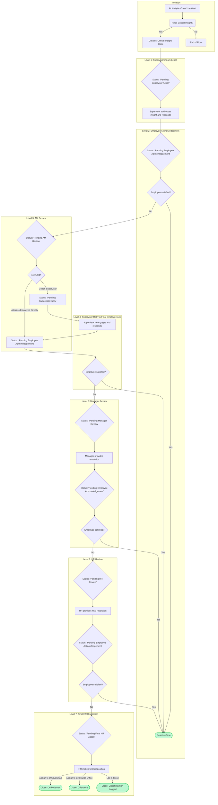
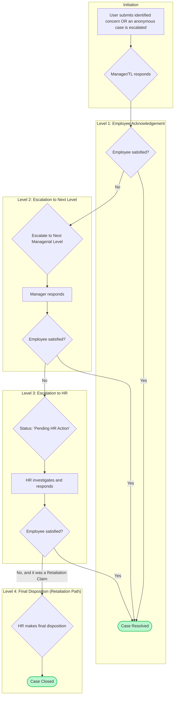

# Escalation Matrix Process Flow

This document outlines the complete escalation workflow for both AI-detected critical insights and user-submitted concerns. You can copy and paste the `mermaid` code blocks into a Mermaid.js viewer (like the one in VS Code or online) to see the visual chart.

## Path 1: AI-Detected Critical Insight from 1-on-1

This flow is triggered automatically when the AI analysis of a 1-on-1 session identifies a `criticalCoachingInsight`.

## Path 2: User-Submitted Concern Escalation

This flow starts when a user submits an identified concern or escalates an anonymous one. The entry point here assumes a manager has already responded to a case and the employee is not satisfied.

